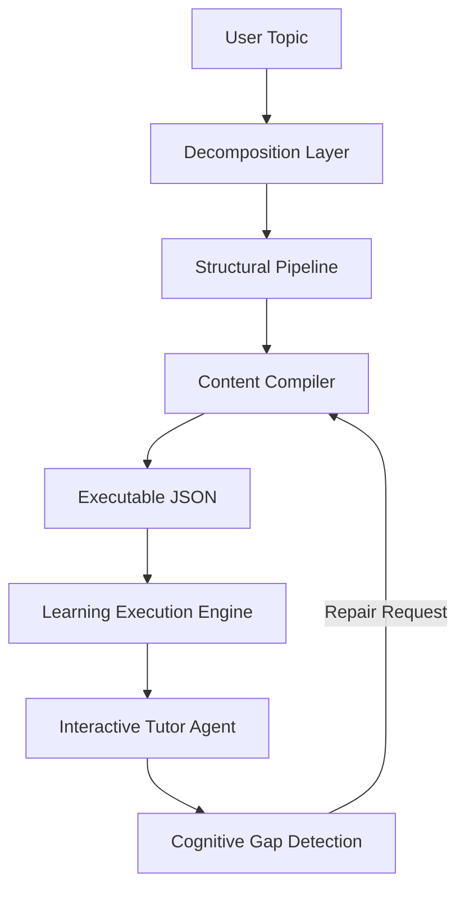

# LearnOS: The Learning Operating System

LearnOS is an autonomous cognitive engine that transforms any topic into a strictly-governed, executable learning program. It uses a multi-stage LLM-powered compiler to design curriculum structures that prioritize pedagogical integrity over simple content generation.

## 🧠 Core Philosophy

Most learning platforms are static catalogs. LearnOS is a dynamic **Runtime**. It doesn't just "show" content; it **compiles** a path based on cognitive topography, executes it in a controlled environment, and adapts to detected knowledge gaps in real-time.

---

## 📐 The Blueprint: Course Compilation Specification (v3.0)

Every course in LearnOS follows a deterministic structural specification. This ensures that the Learning Execution Engine can process any subject with the same level of precision.

### 1. Decomposition Layer (Stage 1)
Identifies the subject's **Taxonomy** and **Cognitive Load**.
- **Process**: Cognitive topography.
- **Outputs**: Taxonomy concepts, difficulty model (linear/adaptive), and assessment strategy.

### 2. Structural Pipeline (Stage 2)
Designs the **Pedagogical Skeleton**.
- **Process**: Sequenced module drafting.
- **Outputs**: Sequenced module pipeline with strict dependency mapping (`requires` edges).

### 3. Content Compiler (Stage 3)
Generates **Granular Lessons** and **Pedagogical Reasoning**.
- **Process**: High-density compilation.
- **Outputs**: The final `Course` object containing typed lessons (`concept`, `practice`, `assessment`) and explicit pedagogical reasoning.

---

## 🛠 Technical Architecture

### Pipeline Flow


### Execution States
Each learner transitions through a finite state machine managed by the `ExecutionEngine`:
- **NOT_STARTED**: Initial state.
- **GENERATED**: Structure compiled but not accessed.
- **IN_PROGRESS**: Active learning session.
- **BLOCKED**: Gap detected, remediation required.
- **MASTERED**: Assessment criteria met.
- **COMPLETED**: Terminating state for the module/course.

### Data Model (Core Specification)
```json
{
  "topic": "string",
  "difficulty_model": "linear | adaptive",
  "estimated_duration": "number",
  "modules": [
    {
      "id": "string",
      "title": "string",
      "difficulty": "number",
      "lessons": [
        {
          "id": "string",
          "title": "string",
          "type": "concept | practice | assessment",
          "prerequisites": ["string"],
          "content_spec": {
            "explanation_required": "boolean",
            "example_required": "boolean",
            "exercise_required": "boolean"
          },
          "pedagogical_reasoning": "string"
        }
      ]
    }
  ],
  "dependency_graph": [
    { "from": "string", "to": "string", "type": "requires" }
  ]
}
```

---

## 🚀 Key Features

- **Autonomous Synthesis**: Generates full curricula from single-line prompts using Groq Llama-3.
- **Cognitive Mapping**: Visualizes dependencies between concepts before you start.
- **Adaptive Remediation**: Detects struggling areas and "repairs" the course path dynamically.
- **Agentic Tutoring**: Context-aware AI tutor synchronized with your current execution state.

## ⚙️ Development

### Environment
- **Runtime**: Node.js / Next.js 15
- **Styling**: Tailwind CSS 4.0
- **Intelligence**: Groq (Llama-3.3-70b-versatile)
- **State**: LocalStorage Persistence (ExecutionEngine)

### Setup
1. Clone the repository.
2. Define `GROQ_API_KEY` in your `.env`.
3. Run `npm install && npm run dev`.

---

*LearnOS: Engineering the future of cognitive distribution.*
